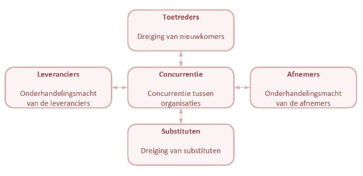

# Hoofdstuk I

## Economische organisatievormen
 * **Planeconomie:** of centraal geleide economie; staat is enige aanbieder van alles
 * **Kapitalisme:** iedereen bepaalt vraag en aanbod; geen begeleiding
 * **Gemengde economie:** Kapitalisme + socialisme; vrije markt overheerst

## Niveaus in de economie
 * **Macro-economie:** Nationaal niveau
 * **Meso-economie:** Markt of bedrijfstak
 * **Micro-economie:** Gezinnen, bedrijven en dergelijke

## Economische kringloop

## Bedrijfskolom
 * **Integratie:** Verkorten van bedrijfskolom; bv verkoop in bakkerij doen
 * **Differentiatie:** Verlengen van bedrijfskolom; bv verkoop afstoten uit bakkerij, groothandel invoeren
 * **Parallellisatie:** Assortiment vergroten
 * **Specialisatie:** Assortiment beperken

## Verschillende sectoren
 * **Marktsector:** Ondernemingen met winstoogmerk
 * **Primaire sector:** Brengen grondstoffen voort
 * **Secundaire sector:** Verwerkt grondstoffen
 * **Tertiaire sector:** Distributie van producten uit primaire of secundaire sector
 * **Collectieve of quartaire sector:** Ondernemingen zonder winstoogmerk bv overheid

## Prijselasticiteit
 * Verschil gevraagde hoeveelheid in % / Verschil prijs in %
   * < -1: elastische vraag
   * < 0 & > -1: inelastische vraag
   * **Snobgoederen:** positief verband; prijs maakt exclusief
   * **Levensnoodzakelijke goederen:** ongeveer nul; prijs maakt niet uit
 * **Kruislingse elasticiteit:** Verschil in vraag als een ander product van prijs verandert
   * **Complementaire goederen(benzine & auto’s):** negatief verband
   * **Substitutiegoederen(auto & fiets):** positief verband
 * **Inkomenselasticiteit:** Verschil gevraagde hoeveelheid in % / Verschil inkomen in %
 * **Aanbodelasticiteit:** Verschil aangeboden hoeveelheid in % / Verschil prijs in %

## Marktvormen

<table border>
	<tr>
		<td><b>Aanbieders / product</b></td>
		<td><b>Homogeen</b></td>
		<td><b>Heterogeen</b></td>
	</tr>
	<tr>
		<td><b>Veel</b></td>
		<td>Volledige vrije mededinging</td>
		<td><b>Monopolistische concurrentie</b> Elke aanbieder maakt eigen monopolie.</td>
	</tr>
	<tr>
		<td><b>Weinig</b></td>
		<td>Homogene oligopolie</td>
		<td>Heterogene oligopolie</td>
	</tr>
	<tr>
		<td><b>Een</b></td>
		<td colspan=2 align="center">Monopolie</td>
	</tr>
</table>

# Hoofdstuk II

## "5 forces" model Porter

De felheid van het concurrentieveld wordt bepaald door een aantal zaken:

## Samenwerking

Meerdere voordelen:

 * Lagere kosten door schaalvoordelen
 * Betere toegang tot nieuwe markten, technologieën en innovaties
 * Ontmoedigen van nieuwe toetreders
 * Reduceren van de risico's bij bedrijfsuitbreiding

### Joint venture

Meerdere partijen spreken af om een economische activiteit samen uit te voeren. De partijen delen dan ook in winst of verlies. De activiteit heeft een bepaalde duur en is geen langdurige zakelijke verbintenis. 

### Franchising

Een externe partij neemt de verkoopactiviteiten over van een bepaalde winkel. De winkel blijft onder dezelfde naam en verkoopt dezelfde artikelen op dezelfde manier (assortiment en verkoopformule blijven gelijk). Kort gesteld mag men ervan uitgaan dat de klanten geen verschil mogen merken terwijl het management van de winkel overgedragen is naar een externe partij.

### Fusie en overname

Een fusie is een samenvloeiing van meerdere bedrijven, waarbij een overname voorkomt als een van de partijen aanzienlijk groter is dan de andere en deze als het ware opslokt. Enkel bedrijven met eenzelfde rechtsvorm mogen fuseren en grote bedrijven moeten hun fusievoorstel voorleggen aan de overheid en dergelijke instanties om concurrentie een kans te geven. Een fusie kan doorgaan via een aandelenruil, het ene bedrijf dat 100% van de aandelen van het andere koopt, een fusiebedrijf dat 100% van de aandelen van beide ondernemingen koopt.

Een fusie is een zeer ingewikkeld proces en vergt veel voorbereiding. 

## Transformatieproces

### Input

De onderneming zal volgende producten moeten inkopen bij leveranciers:

 * personeel
   * arbeidskracht
   * kennis
 * grondstoffen
 * halffabrikaten
 * machines
 * gereedschap
 * grond
 * gebouwen
 * informatie

### Fabricage (throughput)

In deze stap wordt de input omgezet in de output. Hierbij zullen eindproducten en verspilde producten uit voort komen. Ook worden machines en personeel gebruikt en zullen naarmate de tijd vordert in waarde dalen.

### Output

De output zijn de afgewerkte producten of diensten die aangeboden worden op de markt. Ook versleten machines of personeel, afval en uitval verlaten het fabricageproces. 

### Transacties

De onderneming ontvangt opbrengsten in de vorm van geld en feedback over klanttevredenheid.

### Financiën

Het geld van da verkoopstransacties vloeit naar de inkoop bij leveranciers.

### Organisatie

De volgende afdelingen zijn betrokken bij het transformatieproces:

 * Inkoop
   * Stemt de levering van materialen en grondstoffen af op de behoefte
   * Selecteert en onderhandelt met leveranciers
   * Voorkomen dat productieproces ooit stilvalt
 * Marketing
   * Communiceren over voordelen van het product
   * Om nieuwe en bestaande klanten aan te sporen product te kopen
   * Door marktonderzoeken ontwikkeling van nieuwe producten
 * Administratie
   * Controle op betaling van debiteuren
   * Controle op ruimte om crediteuren te betalen
   * Verzorgt de boekhouding
   * Ondersteunt andere afdelingen bij het opstellen van de jaarlijkse budgetten
 * Verkoop
   * Verkopers proberen de interesse van de klanten zoveel mogelijk om te zetten in transacties
   * Klantenservice
 * Operations
   * Verzorgt fabricageproces en logistiek
   * Bij dienstverlenende ondernemingen backoffice, waar diensten worden verwerkt in databank
 * Personeelszaken
   * Ondersteunen de werving, selectie, ontwikkeling en training van het personeel
 * ICT
   * Verzorgen hard- en software
   * Installatie en onderhoud van computersystemen

### Soorten transformatieprocessen

Een industriële onderneming produceert fysieke producten. Stukproductie vs massaproductie: stukproductie is eerst wensen van klant vaststellen en daarna produceren; bij massaproductie wordt er in grote getalen geproduceerd en meestal ook een stock aangehouden.

Handelsondernemingen bieden gemak en service aan aan klanten. Er is geen transformatieproces.

Bij dienstverlenende ondernemingen worden er geen producten verkocht, maar prestaties. Het transformatieproces is het verwerken van gegevens van de klant tot relevante informatie (doktersbezoek), of het specifiek ordenen van goederen (bouwvakker). Diensten hebben 4 basiskenmerken:

 * ontastbaar: diensten zijn niet fysiek aan te raken
 * vergankelijk: diensten kunnen niet op voorraad gehouden worden
 * heterogeen: kunnen nooit 2 keer volledig identiek zijn
 * interactieve consumptie: klant speelt een belangrijke rol in de dienst en moet vaak ook aanwezig zijn

## Klantbehoefte

Indien een onderneming naar de klanten luistert en daarop inspeelt, zal deze vele voordelen hieraan overhouden. Tevreden klanten keren terug naar de onderneming voor meer aankopen, wat leidt tot een hogere opbrengst. Klanten die het gevoel hebben dat ze belang hebben voor de onderneming zullen zich meer betrokken voelen bij de onderneming. Tevreden klanten zullen enthousiast vertellen over de producten aan hun vrienden.

Een **productiegeorienteerde** onderneming richt zich op het zo efficiënt mogelijk uitvoeren van het fabricageproces, om de producten zo goedkoop mogelijk te produceren. Deze aanpak zal mislukken indien de marktomstandigheden veranderen.

Een **productgeorienteerde** onderneming focust zijn energie op het leveren van zo hoog mogelijke kwaliteit en zal zo klanten overtuigen.

Een **verkoopgerichte** onderneming zal hevig inzetten op de verkoop en zal klanten verleiden tot aankopen via  verkoopspraatjes.

Een marktgerichte aanpak is vereist om op lange termijn te overleven. 

### Marketingproces

Het marketing in zijn meest simpele vorm bestaat uit de volgende stappen:

1. Onderzoek van de markt
 * Macro-economie
 * Bedrijfstak
 * Concurrenten
 * Distributie
2. Vaststellen van doelgroepen en doelstellingen
 * Markt onderverdelen in segmenten
 * Doelstellingen opstellen per segment
3. Ontwikkelen van het aanbod en de aanpak: marketingmix
 * productbeleid: Wat moeten we veranderen aan het product of de verkoop?
 * prijsbeleid: Welke prijs is optimaal?
 * promotiebeleid: Hoe doelgroep informeren? 
 * plaats(placement-distributie): Hoe aanbod optimaal aanbieden aan doelgroep?
 * **5P:** personeel: Aflevering van een dienst
4. Uitvoeren en implementeren van de commerciële activiteiten
 * Medewerkers motiveren en opleiden
5. Controle, evaluatie en bijsturen

<!--- TODO
hfdst3:
ratio's berekenen en interpreteren
grote oefening

hfdst4:
vaste/var kosten
AC/DC
breakevenanlyse
grote oefening

hfdst5:
uitval/afval
soorten kosten
niet SOTYD
wel degressief, zie chamomo
belastingen p152 niet
budgetteren lezen
balanced sorecard
agencytheory

hfdst6:
investeringsanalyse
--->