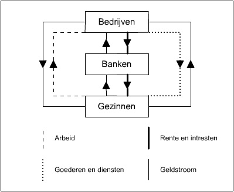

# Hoofdstuk I

## Economische organisatievormen
 * **Planeconomie:** of centraal geleide economie; staat is enige aanbieder van alles
 * **Kapitalisme:** iedereen bepaalt vraag en aanbod; geen begeleiding
 * **Gemengde economie:** Kapitalisme + socialisme; vrije markt overheerst

## Niveaus in de economie
 * **Macro-economie:** Nationaal niveau
 * **Meso-economie:** Markt of bedrijfstak
 * **Micro-economie:** Gezinnen, bedrijven en dergelijke

## Economische kringloop

## Bedrijfskolom
 * **Integratie:** Verkorten van bedrijfskolom; bv verkoop in bakkerij doen
 * **Differentiatie:** Verlengen van bedrijfskolom; bv verkoop afstoten uit bakkerij, groothandel invoeren
 * **Parallellisatie:** Assortiment vergroten
 * **Specialisatie:** Assortiment beperken

## Verschillende sectoren
 * **Marktsector:** Ondernemingen met winstoogmerk
 * **Primaire sector:** Brengen grondstoffen voort
 * **Secundaire sector:** Verwerkt grondstoffen
 * **Tertiaire sector:** Distributie van producten uit primaire of secundaire sector
 * **Collectieve of quartaire sector:** Ondernemingen zonder winstoogmerk bv overheid

## Prijselasticiteit
 * Verschil gevraagde hoeveelheid in % / Verschil prijs in %
   * < -1: elastische vraag
   * < 0 & > -1: inelastische vraag
   * **Snobgoederen:** positief verband; prijs maakt exclusief
   * **Levensnoodzakelijke goederen:** ongeveer nul; prijs maakt niet uit
 * **Kruislingse elasticiteit:** Verschil in vraag als een ander product van prijs verandert
   * **Complementaire goederen(benzine & auto’s):** negatief verband
   * **Substitutiegoederen(auto & fiets):** positief verband
 * **Inkomenselasticiteit:** Verschil gevraagde hoeveelheid in % / Verschil inkomen in %
 * **Aanbodelasticiteit:** Verschil aangeboden hoeveelheid in % / Verschil prijs in %

## Marktvormen

<table border>
	<tr>
		<td><b>Aanbieders / product</b></td>
		<td><b>Homogeen</b></td>
		<td><b>Heterogeen</b></td>
	</tr>
	<tr>
		<td><b>Veel</b></td>
		<td>Volledige vrije mededinging</td>
		<td><b>Monopolistische concurrentie</b> Elke aanbieder maakt eigen monopolie.</td>
	</tr>
	<tr>
		<td><b>Weinig</b></td>
		<td>Homogene oligopolie</td>
		<td>Heterogene oligopolie</td>
	</tr>
	<tr>
		<td><b>Een</b></td>
		<td colspan=2 align="center">Monopolie</td>
	</tr>
</table>

# Hoofdstuk II

## "5 forces" model Porter

<!--- TODO
hfdst2:
porter wel
rechtsvormen niet
samenwerkingen vanaf 46: korte definitie
transformatieproces!
kantbehoefte! meekeuze
4P's!

hfdst3:
ratio's berekenen en interpreteren
grote oefening

hfdst4:
vaste/var kosten
AC/DC
breakevenanlyse
grote oefening

hfdst5:
uitval/afval
soorten kosten
niet SOTYD
wel degressief, zie chamomo
belastingen p152 niet
budgetteren lezen
balanced sorecard
agencytheory

hfdst6:
investeringsanalyse
--->