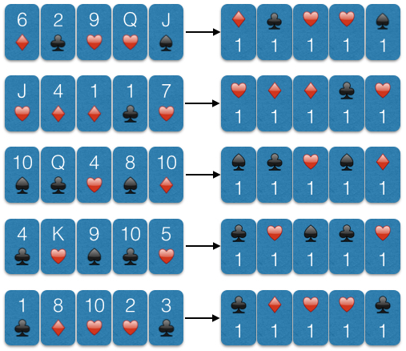
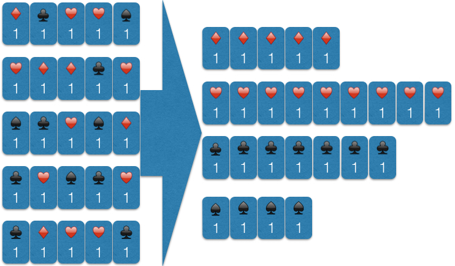
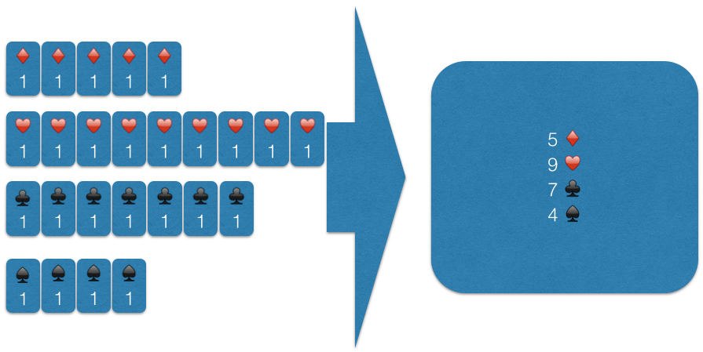

# Hadoop
========

## Introduction

Volume, Variety and Velocity are 3 problems that relational databases have trouble with. Hadoop tries to solve this with HDFS, in which it uses distributed data, redundancy and namenodes to guarantee uptime and fast computation

## HDFS

### Intro

1 Namenode and multiple datanodes.

Data is distributed in blocks of (default) 64MB.

Data is duplicated on the drives to reduce problems on hardware failure.

Namenode has duplicates too.

### Commands

View contents of HDFS

    hadoop fs -ls

Put file in HDFS

    hadoop fs -put file

A few bash commands work in the HDFS:

    hadoop fs -command
    tail
    cat
    cp
    mv
    rm
    mkdir
    du

To check the health and duplication status of the HDFS

    hdfs dfsadmin -report

To modify block sizes

    src/hadoop-common-project/hadoop-common/src/test/resources/core-site.xml

## MapReduce

Mapreduce is an algorithm designed for distributed file systems, as it is better to do calculations at the same time on multiple drives (map) and then after that combine them to return it (reduce)

### Example

A group of 6 people (6 blocks) each hold 5 cards (blocksize 5), they want to know how many cards of suit hearts there are.

They go through their own cards and write on notes the useful information of every card (only the suit); let's say they note only the suit and the number 1 (as this is a key/value pair and will be clear when we program this). Everyone now has 5 notes with a list of suits in their cards.

So a person holding a 6 of diamonds, a 2 of clubs, a 9 of hearts, a queen of hearts and a jack of spades will have the following notes:

    diamonds 1
    clubs 1
    hearts 1
    hearts 1
    spades 1

Now they all split their notes on the key (the suit) and give the stack of notes to the appropriate guy. So there will be 4 guys (reducers), each receiving all notes of the same suit.

The 4 guys (reducers) now count the values and sum these and announce these. Now the MapReduce is finished.

To put it in a diagram: 
#### Map

#### Reduce

#### Result

